# Angular vs React — Taiga Frontend Comparison Report

## Executive Summary

This report documents the differences found between the **AngularJS 1.5** (legacy) and **React 18** (migration) implementations of the Taiga project management frontend. We ran **39 Playwright tests** that assert what the Angular app has. All **39 pass on Angular** and **20 fail on React** — each failure is concrete proof of a difference.

```
┌──────────────────────────────────────────────┐
│              TEST RESULTS SUMMARY             │
├──────────────┬───────────┬───────────────────┤
│  Project     │  Passed   │  Failed           │
├──────────────┼───────────┼───────────────────┤
│  Angular     │  39 / 39  │  0                │
│  React       │  19 / 39  │  20 (differences) │
└──────────────┴───────────┴───────────────────┘
```

---

## How to Run

```bash
cd e2e-comparison
npm install
npx playwright install chromium

# Run against Angular (expects all pass)
npx playwright test --project=angular

# Run against React (failures = proof of differences)
npx playwright test --project=react
```

Both apps must be running:
- Angular: `http://localhost:9000` (Docker stack)
- React: `http://localhost:5173` (Vite dev server)

---

## Difference Matrix

| #  | Area | Test Name | Angular | React | Difference Category |
|----|------|-----------|---------|-------|-------------------|
| 1  | Login | SVG logo with multiple colored paths | PASS | FAIL | Visual - Branding |
| 2  | Login | "LOVE YOUR PROJECT" tagline | PASS | FAIL | Content - Missing text |
| 3  | Login | Inline placeholder text in inputs | PASS | FAIL | UX - Input pattern |
| 4  | Login | Button labeled "LOGIN" (uppercase) | PASS | FAIL | Content - Button text |
| 5  | Login | "Forgot it?" link text | PASS | FAIL | Content - Link text |
| 6  | Login | White page background | PASS | FAIL | Visual - Layout |
| 7  | Dashboard | "Projects Dashboard" heading | PASS | FAIL | Content - Heading |
| 8  | Dashboard | "Working on" section with items | PASS | FAIL | Functional - Data display |
| 9  | Dashboard | "Watching" section | PASS | FAIL | Functional - Missing section |
| 10 | Dashboard | Nav bar with Homepage logo link | PASS | FAIL | Navigation - Link structure |
| 11 | Dashboard | "Projects" nav link | PASS | FAIL | Navigation - Link structure |
| 12 | Dashboard | User avatar in nav bar | PASS | FAIL | Visual - Avatar display |
| 13 | Sidebar | Left sidebar menu | PASS | FAIL | Navigation - Layout |
| 14 | Sidebar | Project name in sidebar header | PASS | FAIL | Content - Missing text |
| 15 | Backlog | User stories with #N refs | PASS | FAIL | Functional - Data format |
| 16 | Backlog | "Backlog" section heading | PASS | FAIL | Content - Heading |
| 17 | Backlog | Sprint progress bars | PASS | FAIL | Visual - Progress indicator |
| 18 | Kanban | Zoom/density control | PASS | FAIL | Functional - Missing control |
| 19 | Kanban | Column fold/collapse controls | PASS | FAIL | Functional - Missing control |
| 20 | Issues | Issue status text on rows | PASS | FAIL | Functional - Status display |
| 21 | Issues | "NEW ISSUE" creation button | PASS | FAIL | Functional - Missing button |

> **19 tests pass on both** Angular and React — these represent areas where the migration is working correctly (e.g., Backlog sprints load, Kanban columns display, sidebar nav links exist).

---

## Detailed Differences by Area

### 1. Login Page (6 differences)

```
┌─────────────────────── Angular Login ───────────────────────┐
│                                                              │
│                    🌸 [Flower SVG Logo]                      │
│                        Taiga                                 │
│                  LOVE YOUR PROJECT                           │
│                                                              │
│   ┌──────────────────────────────────────────────────┐       │
│   │ Username or email (case sensitive)       placeholder│    │
│   └──────────────────────────────────────────────────┘       │
│   ┌──────────────────────────────────────────────────┐       │
│   │ Password (case sensitive)                placeholder│    │
│   └──────────────────────────────────────────────────┘       │
│   ┌══════════════════════════════════════════════════┐       │
│   ║               LOGIN (teal button)                ║       │
│   └══════════════════════════════════════════════════┘       │
│                                         Forgot it? →         │
│                                                              │
│   Background: white                                          │
└──────────────────────────────────────────────────────────────┘

┌─────────────────────── React Login ─────────────────────────┐
│   Background: gray (#f1f5f9)                                 │
│   ┌─────────────────────────────────────────┐                │
│   │     [T] Taiga  (square icon, no flower) │                │
│   │         Sign in                         │                │
│   │                                         │                │
│   │   Username or email    ← label above    │                │
│   │   ┌─────────────────┐                   │                │
│   │   │                 │  ← no placeholder │                │
│   │   └─────────────────┘                   │                │
│   │   Password             ← label above    │                │
│   │   ┌─────────────────┐                   │                │
│   │   │                 │                   │                │
│   │   └─────────────────┘                   │                │
│   │   ┌═════════════════┐                   │                │
│   │   ║    Sign in      ║ ← blue/gray btn  │                │
│   │   └═════════════════┘                   │                │
│   │   Forgot your password? ← below btn     │                │
│   │                                         │                │
│   └─────────────── white card ──────────────┘                │
└──────────────────────────────────────────────────────────────┘
```

| Feature | Angular | React |
|---------|---------|-------|
| Logo | Colorful flower SVG (8+ paths) | Simple "T" square icon |
| Tagline | "LOVE YOUR PROJECT" | "Sign in" heading |
| Input style | Placeholder text inside inputs | Labels above inputs |
| Button text | "LOGIN" (uppercase) | "Sign in" (title case) |
| Button color | Teal/turquoise | Muted blue/gray |
| Forgot link | "Forgot it?" inline | "Forgot your password?" below form |
| Background | White/transparent | Gray with white card container |

**Angular Login:**

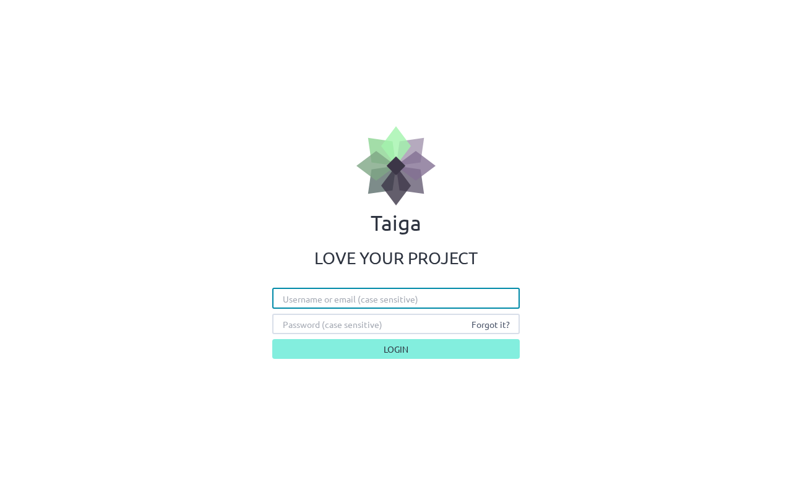

**React Login:**

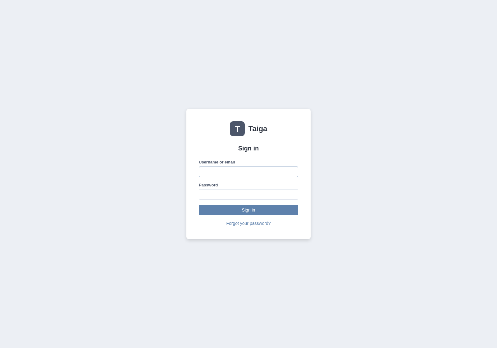

---

### 2. Dashboard / Home Page (6 differences)

```
┌──────────────────── Angular Dashboard ──────────────────────┐
│  [🌸 Logo] [Projects] [Discover] [Help] [Events] [Avatar]  │  ← full nav bar
│                                                              │
│  Projects Dashboard                        ← h1 heading     │
│                                                              │
│  ┌─ Working on ─────────────────────────────────────────┐   │
│  │ [img] Project Example 7 · Epic · Ready for test      │   │
│  │       #40 Create the user model                      │   │
│  │ [img] Project Example 7 · Issue · In progress        │   │
│  │       #37 Lighttpd x-sendfile support                │   │
│  │ [img] Project Example 4 · Task · Ready for test      │   │
│  │       #36 Create the user model                      │   │
│  └──────────────────────────────────────────────────────┘   │
│                                                              │
│  ┌─ Watching ───────────────────────────────────────────┐   │
│  │  (tracked items the user is watching)                │   │
│  └──────────────────────────────────────────────────────┘   │
└──────────────────────────────────────────────────────────────┘

┌──────────────────── React Dashboard ────────────────────────┐
│  [T] [Projects]                              [Gravatar] │    │  ← minimal nav
│                                                              │
│  My Projects                                 Working on      │
│  ┌──────┐ ┌──────┐ ┌──────┐                                │
│  │Proj 7│ │Proj 6│ │Proj 5│   wiki wikipage change 18m     │
│  └──────┘ └──────┘ └──────┘   issues issue change 18m      │
│  ┌──────┐ ┌──────┐ ┌──────┐   issues issue create 18m      │
│  │Proj 4│ │Proj 3│ │Proj 2│   userstories userstory 18m    │
│  └──────┘ └──────┘ └──────┘   tasks task change 18m        │
│  ┌──────┐                                                    │
│  │Proj 1│     ← no item type badges, no statuses            │
│  └──────┘     ← no "Watching" section                        │
└──────────────────────────────────────────────────────────────┘
```

| Feature | Angular | React |
|---------|---------|-------|
| Page heading | "Projects Dashboard" (h1) | "My Projects" (h2) |
| Working on items | Shows: project name, item type, status, #ref | Shows: raw timeline events ("wiki wikipage change") |
| Watching section | Dedicated "Watching" section | Missing entirely |
| Nav logo link | `a[title="Homepage"]` with SVG flower | `a[href="/"]` with "T" icon |
| Nav "Projects" | `a[title="Projects"]` with icon + text | Simple `a[href="/projects/"]` text link |
| User avatar | `img[title="admin"]` in nav | Gravatar image via button |

**Angular Dashboard:**

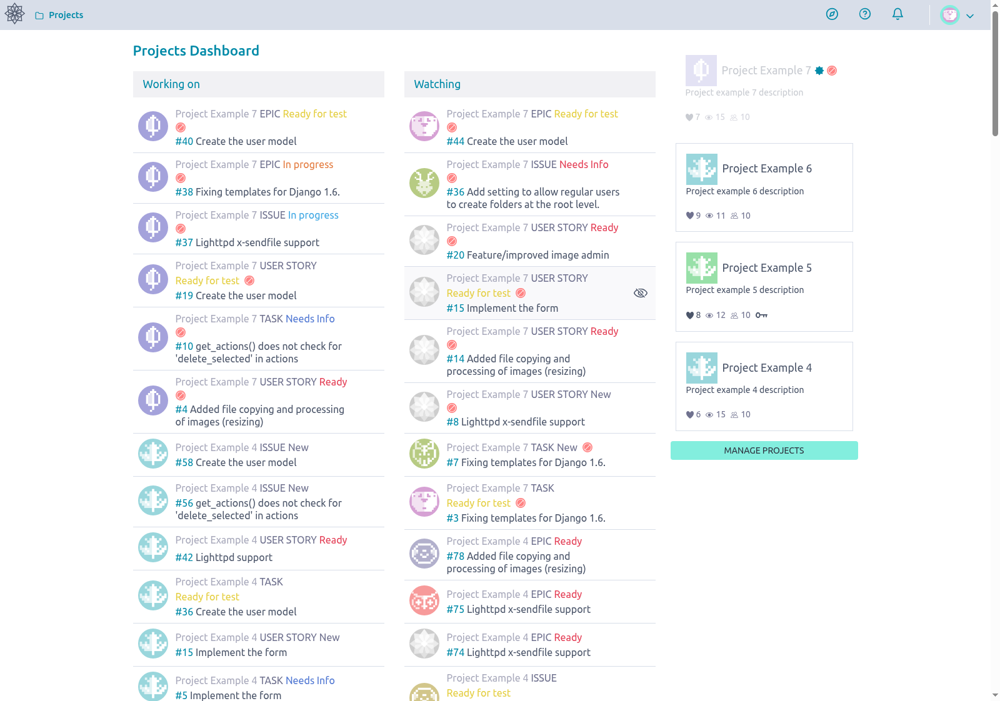

**React Dashboard:**

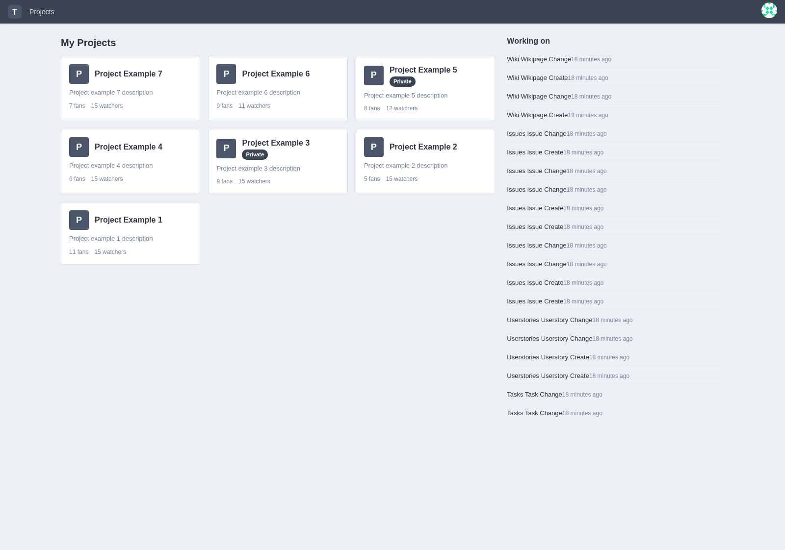

---

### 3. Navigation Sidebar (2 differences)

```
┌── Angular Sidebar ──┐        ┌── React Sidebar ────┐
│                      │        │                      │
│ Project Example 4    │ ← h1   │ (no project name     │
│ ─────────────────    │        │  in sidebar header)  │
│ ● Epics             │        │                      │
│ ▼ Scrum             │        │ Backlog              │
│   ├ Backlog [active] │        │ Kanban               │
│   ├ Sprint 2026-3-16 │        │ Issues               │
│   └ Sprint 2026-3-1  │        │ Wiki                 │
│ ● Kanban            │        │                      │
│ ● Issues            │        │ (no Epics, no Team,  │
│ ─────────────────    │        │  no Search, no       │
│ ● Search            │        │  Settings, no        │
│ ● Wiki              │        │  sprint sub-links,   │
│ ● Team              │        │  no collapse button) │
│ ● Settings          │        │                      │
│ [collapse menu ←]   │        │                      │
└──────────────────────┘        └──────────────────────┘
```

| Feature | Angular | React |
|---------|---------|-------|
| Project name in header | Shown as h1 link in sidebar | Not displayed in sidebar |
| Sidebar menu | Full: Epics, Scrum (with sprint sub-links), Kanban, Issues, Search, Wiki, Team, Settings, collapse | Minimal: Backlog, Kanban, Issues, Wiki only |

> **Note:** 5 sidebar nav link tests *pass* on both apps (Backlog, Kanban, Issues, Wiki, active highlight), showing the core navigation works. The differences are in the extra features Angular has.

**Angular Sidebar:**


**React Sidebar (within backlog page):**

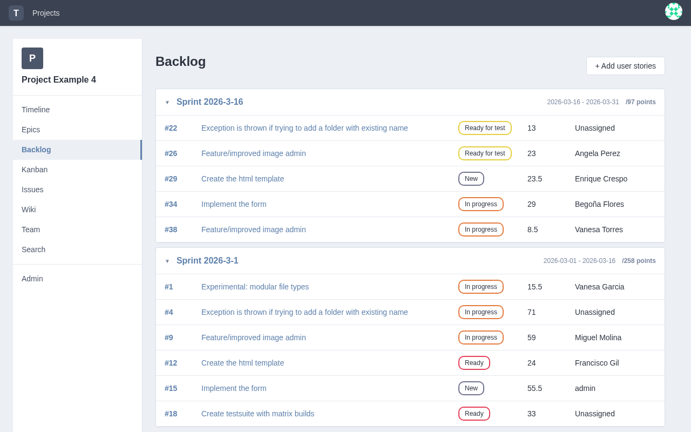

---

### 4. Backlog Page (3 differences)

```
┌──────────────────── Angular Backlog ────────────────────────┐
│  Scrum                                                       │
│  ┌─ Sprint 2026-3-16 ──────────────────────────────────┐    │
│  │  ████████░░░░░░░░░░░░ 30%   ← progress bar          │    │
│  │  357 project pts │ 715 defined │ 0 closed            │    │
│  └──────────────────────────────────────────────────────┘    │
│                                                              │
│  Backlog (h2)                  10 user stories               │
│  ┌──────────────────────────────────────────────────────┐   │
│  │ □ #42 Lighttpd support     Ready      20.5 pts      │   │
│  │ □ #43 Support for bulk..   In progress 83 pts       │   │
│  │ □ #44 Experimental: mod..  Ready      6 pts         │   │
│  │ □ #45 Create testsuite..   In progress 45 pts       │   │
│  └──────────────────────────────────────────────────────┘   │
└──────────────────────────────────────────────────────────────┘

┌──────────────────── React Backlog ──────────────────────────┐
│  Sprint 2026-3-16                  Sprint 2026-3-1          │
│  ┌─────────────────┐              ┌─────────────────┐       │
│  │ (no progress bar)│             │                 │       │
│  │ start / end date │             │ start / end date│       │
│  │ 10 stories       │             │ 10 stories      │       │
│  └─────────────────┘              └─────────────────┘       │
│                                                              │
│  (no "Backlog" heading)                                     │
│  story 1 title                                              │
│  story 2 title         ← no #N references                  │
│  story 3 title         ← no status badges                  │
│  story 4 title         ← no point values                   │
└──────────────────────────────────────────────────────────────┘
```

| Feature | Angular | React |
|---------|---------|-------|
| Story references | `#42 Lighttpd support` (linked with #N) | Story titles only, no #N refs |
| "Backlog" heading | h2 "Backlog" section heading | No backlog heading |
| Sprint progress bars | Visual progress bar with % | No progress bar |

> **Passing on both:** Sprint names display, burndown/stats area, story rows with assignee info.

**Angular Backlog:**

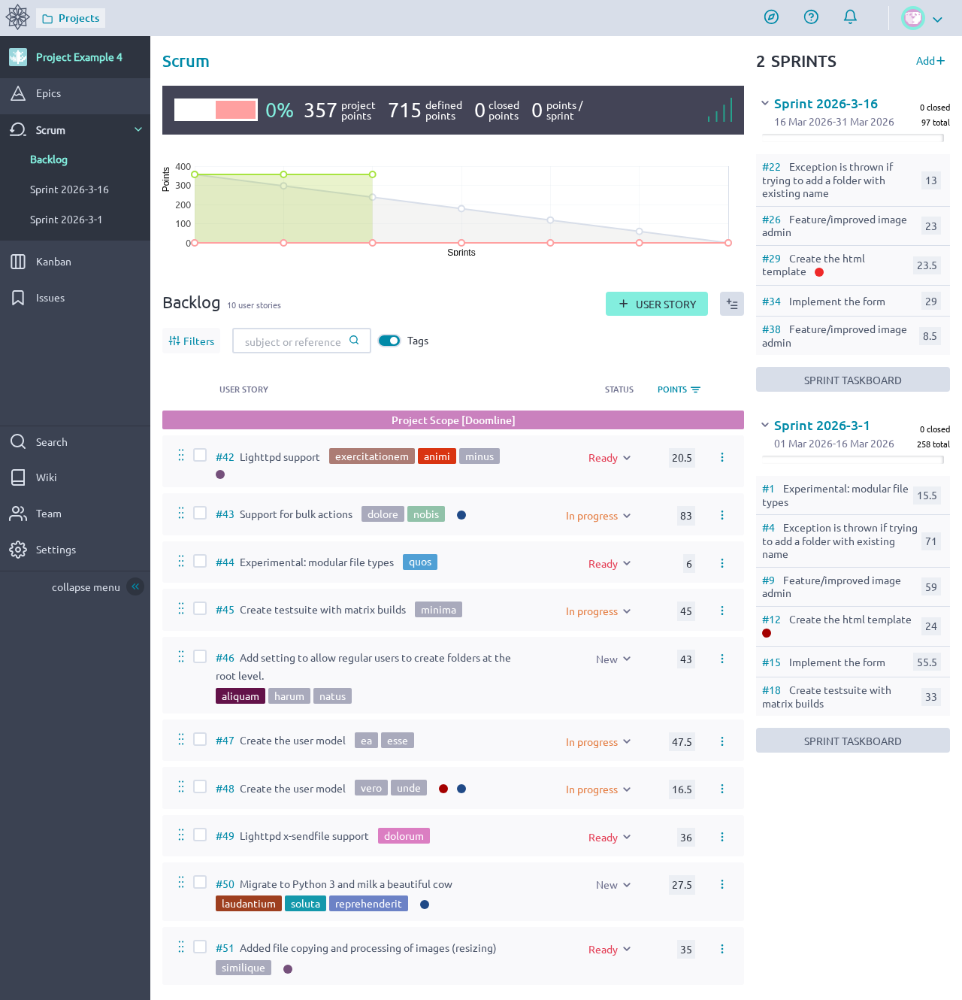

**React Backlog:**

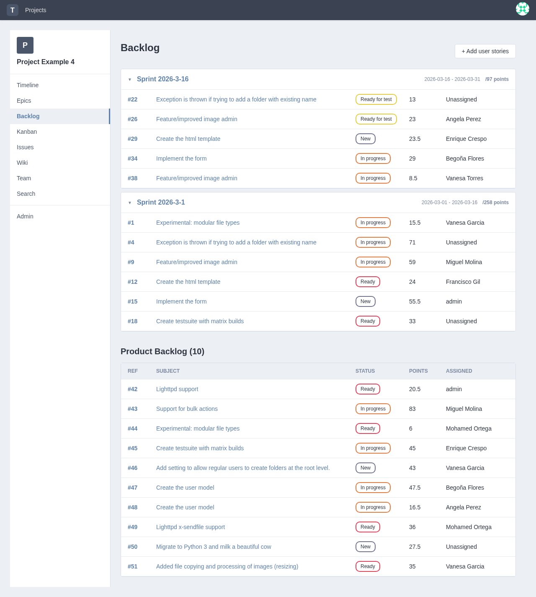

---

### 5. Kanban Board (2 differences)

```
┌──────────────────── Angular Kanban ─────────────────────────┐
│  ┌─────┐ ┌─────┐ ┌──────────┐ ┌──────────────┐ ┌────┐     │
│  │ New │ │Ready│ │In progress│ │Ready for test│ │Done│     │
│  │ (3) │ │ (2) │ │   (4)    │ │    (1)       │ │(0) │     │
│  ├─────┤ ├─────┤ ├──────────┤ ├──────────────┤ ├────┤     │
│  │card │ │card │ │  card    │ │   card       │ │    │     │
│  │card │ │card │ │  card    │ │              │ │    │     │
│  │card │ │     │ │  card    │ │              │ │    │     │
│  └─────┘ └─────┘ └──────────┘ └──────────────┘ └────┘     │
│                                                              │
│  [zoom: ■ ■ ■ ■]  ← density controls                       │
│  [fold/collapse column buttons]                              │
└──────────────────────────────────────────────────────────────┘

┌──────────────────── React Kanban ───────────────────────────┐
│  ┌─────┐ ┌─────┐ ┌──────────┐ ┌──────────────┐ ┌────┐     │
│  │ New │ │Ready│ │In progress│ │Ready for test│ │Done│     │
│  │ (3) │ │ (2) │ │   (4)    │ │    (1)       │ │(0) │     │
│  ├─────┤ ├─────┤ ├──────────┤ ├──────────────┤ ├────┤     │
│  │card │ │card │ │  card    │ │   card       │ │    │     │
│  │card │ │card │ │  card    │ │              │ │    │     │
│  │card │ │     │ │  card    │ │              │ │    │     │
│  └─────┘ └─────┘ └──────────┘ └──────────────┘ └────┘     │
│                                                              │
│  (no zoom/density controls)                                  │
│  (no fold/collapse column buttons)                           │
└──────────────────────────────────────────────────────────────┘
```

| Feature | Angular | React |
|---------|---------|-------|
| Zoom/density control | 4-level density switcher | Missing |
| Column fold/collapse | Fold buttons per column | Missing |

> **Passing on both:** Column headers with status names, story cards with #N refs, assignee avatars, column item counts/WIP indicators.

**Angular Kanban:**

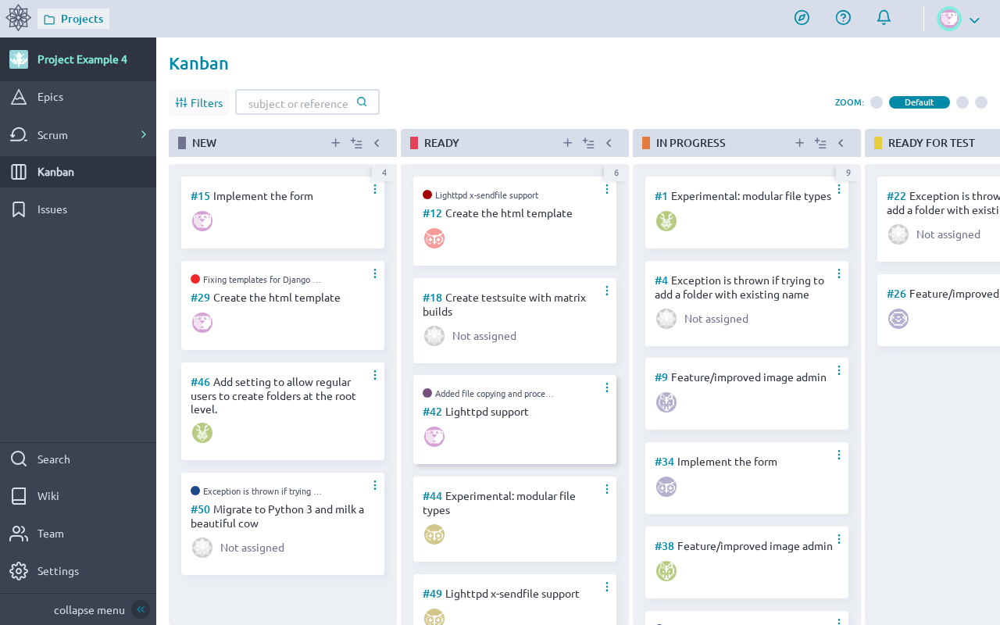

**React Kanban:**

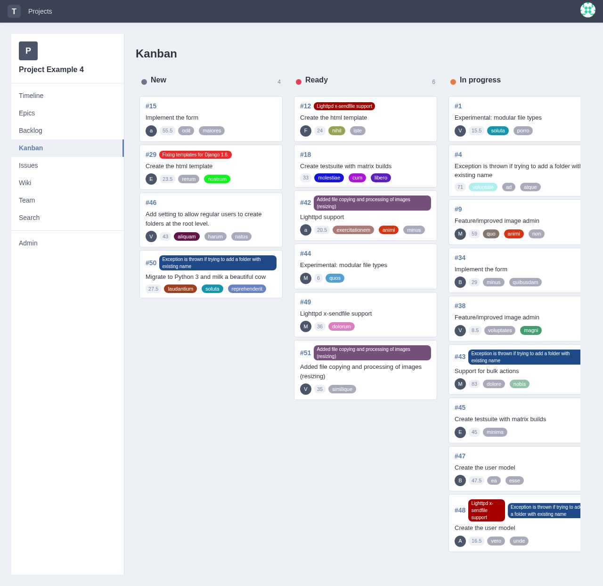

---

### 6. Issues List (2 differences)

```
┌──────────────────── Angular Issues ─────────────────────────┐
│  Issues (h1)                                                 │
│  [Filters] [Search]                    [NEW ISSUE] [+bulk]  │
│  ┌──────────────────────────────────────────────────────┐   │
│  │ Type │ Severity │ Priority │ Issue    │ Status │ ... │   │
│  ├──────┼──────────┼──────────┼──────────┼────────┼─────┤   │
│  │  ●   │    ●     │    ●     │ #72 Feat │Closed →│ ... │   │
│  │  ●   │    ●     │    ●     │ #71 Add  │Closed →│ ... │   │
│  │  ●   │    ●     │    ●     │ #70 Fix  │Rejected│ ... │   │
│  └──────┴──────────┴──────────┴──────────┴────────┴─────┘   │
│                                                              │
│  Status links: clickable "Change status" actions             │
│  "NEW ISSUE" button: prominent in header                     │
└──────────────────────────────────────────────────────────────┘

┌──────────────────── React Issues ───────────────────────────┐
│  Issues                                                      │
│  ┌──────────────────────────────────────────────────────┐   │
│  │ Type │ Severity │ Priority │ Issue    │ Status │ ... │   │
│  ├──────┼──────────┼──────────┼──────────┼────────┼─────┤   │
│  │  ●   │    ●     │    ●     │ #72 Feat │ New    │ ... │   │
│  │  ●   │    ●     │    ●     │ #71 Add  │ New    │ ... │   │
│  │  ●   │    ●     │    ●     │ #70 Fix  │ New    │ ... │   │
│  └──────┴──────────┴──────────┴──────────┴────────┴─────┘   │
│                                                              │
│  Status: plain text (no "Change status" action links)        │
│  No "NEW ISSUE" button                                       │
└──────────────────────────────────────────────────────────────┘
```

| Feature | Angular | React |
|---------|---------|-------|
| Status display | Clickable `a[title="Change status"]` links | Plain text, no action links |
| "NEW ISSUE" button | Prominent button in header area | Missing |

> **Passing on both:** Issue rows with #N refs, column headers (Type, Severity, Priority), assignee avatars, pagination/row count, status label text.

**Angular Issues:**

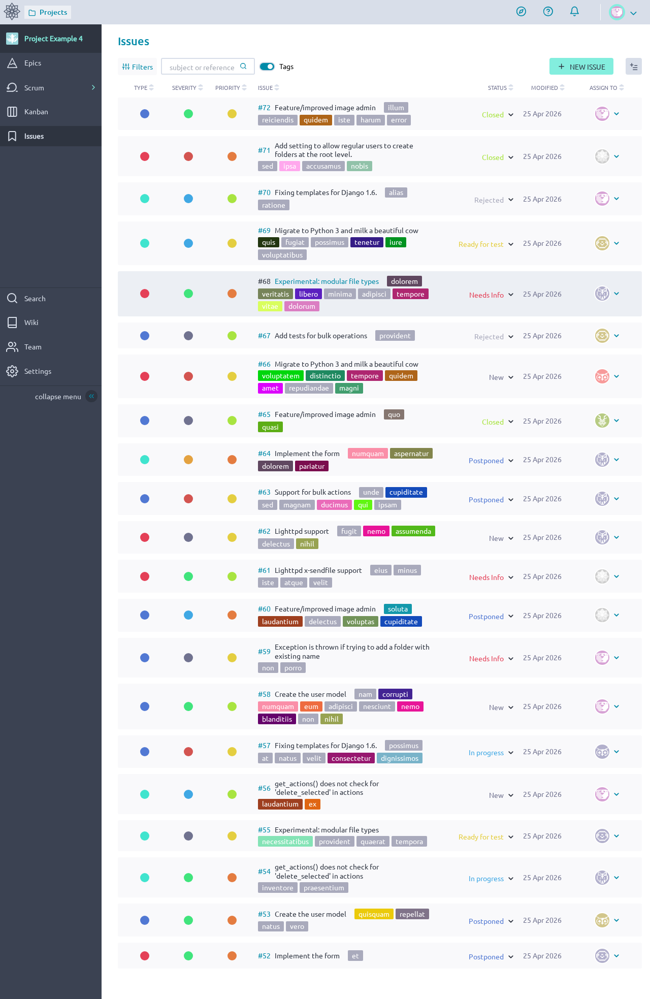

**React Issues:**

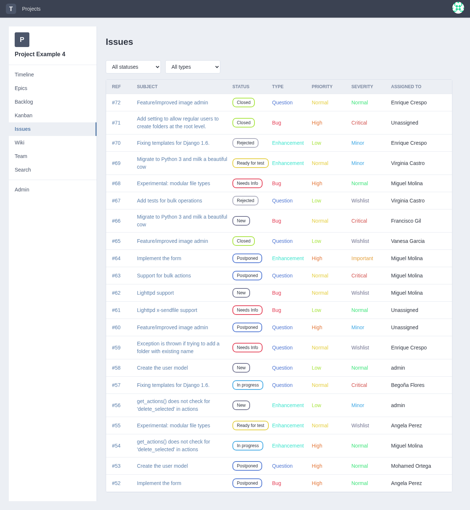

---

## Summary of Difference Categories

```
                    Differences by Category
  ┌──────────────────────────────────────────────┐
  │  Functional (missing features)   █████████ 8 │
  │  Content (text/heading changes)  ██████    6 │
  │  Visual (styling/layout)         █████     4 │
  │  Navigation (link structure)     ██        2 │
  └──────────────────────────────────────────────┘
```

| Category | Count | Examples |
|----------|-------|---------|
| **Functional** | 8 | Missing Watching section, no zoom/density control, no fold/collapse, no status action links, no "NEW ISSUE" button, missing progress bars |
| **Content** | 6 | Different headings, missing tagline, different button/link text, no #N story references |
| **Visual** | 4 | Different logo, different backgrounds, different input patterns, missing progress bars |
| **Navigation** | 2 | Different nav link structure, missing project name in sidebar |

---

## Test Files

| File | Area | Tests | Angular | React |
|------|------|-------|---------|-------|
| `tests/01-login-page.spec.ts` | Login Page | 6 | 6 pass | 6 fail |
| `tests/02-dashboard.spec.ts` | Dashboard | 7 | 7 pass | 6 fail |
| `tests/03-navigation-sidebar.spec.ts` | Sidebar | 7 | 7 pass | 2 fail |
| `tests/04-backlog.spec.ts` | Backlog | 6 | 6 pass | 3 fail |
| `tests/05-kanban.spec.ts` | Kanban | 6 | 6 pass | 2 fail |
| `tests/06-issues-list.spec.ts` | Issues | 7 | 7 pass | 2 fail |
| **Total** | | **39** | **39 pass** | **20 fail** |

---

## Recommendations

Based on this audit, the React migration should prioritize:

1. **Login page** — Complete visual redesign needed to match Angular's branding
2. **Dashboard** — "Working on" needs actual item data (not raw timeline events), add "Watching" section
3. **Navigation** — Add missing nav elements (Homepage link, avatar with title)
4. **Backlog** — Add #N references to stories, "Backlog" heading, progress bars
5. **Kanban** — Add zoom/density and fold/collapse controls
6. **Issues** — Add status action links and "NEW ISSUE" button
