# Taiga AngularJS → React parity audit

_Generated: 2026-04-25T21:48:15.799Z_

> **Scope:** login · dashboard (home) · projects listing · project sidebar · backlog · kanban · issues. Both apps boot off the same `taiga-back` + `taiga-events` stack with the same seeded data, the same admin session is replayed into each, and the same Playwright suite asserts AngularJS behaviour against both targets.

## How to read this report

Each test asserts a feature/marker that the **AngularJS** taiga-front (the read-only spec) ships out of the box. The exact same test runs against the **React port** (`web-react/`). Where the React port has not implemented (or has implemented differently) the asserted feature, the test **fails on React** and **passes on Angular**. Each red ❌ on the React side is a parity gap.

- ✅ — pass
- ❌ — fail (parity gap)
- ⏭️ — skipped

## Reproduce locally

```sh
npm run taiga-up        # gateway + back + events on :9000
npm run taiga-seed      # admin/adminpass + 7 sample projects
npm run react           # web-react dev server on :5173
cd parity-audit && npm install && npx playwright install chromium
PARITY_TARGET=angular npx playwright test
PARITY_TARGET=react   npx playwright test
node build-report.mjs   # writes REPORT.md
```

## Summary

| target  | total | passed | failed | skipped |
| ------- | ----: | -----: | -----: | ------: |
| Angular | 37 | 37 | 0 | 0 |
| React   | 37 | 0 | 37 | 0 |

**Parity gaps detected:** 37 (tests passing on Angular but failing on React).

## Top differences observed

| Page | AngularJS (current) | React port (`web-react`) |
| --- | --- | --- |
| Login | "LOVE YOUR PROJECT" tagline, Taiga star logo (multi-path SVG), placeholder "Username or email (case sensitive)", "LOGIN" button (uppercase), inline "Forgot it?" link, document title `Login - Taiga` | "A simple project management platform" tagline, generic cube logo, separate field labels (no placeholder), "Sign in" button, separate "Forgot your password?" link, document title `Taiga (React port)` |
| Dashboard (`/`) | Page heading "Projects Dashboard", split into "Working on" and "Watching" sections, each row shows ticket project + type + status + ref, navbar includes a Projects dropdown with "View all projects" link | "Working on" tile + "Activity" timeline (no Watching, no Projects Dashboard heading), flat NavLinks "Home / Discover / My Projects", no Projects dropdown |
| My projects (`/projects/`) | "NEW PROJECT" CTA (uppercase), reorder helper aside, projects ordered by user-defined `project_index_order` (newest first), no in-page search input, key icon for private projects | "+ New project" CTA, no reorder hint, projects in ascending order, adds a Filter projects search box, "Public"/"Private" text labels |
| Project sidebar | "Scrum" group containing Backlog + sprint links, "Settings" link (admin gate), "collapse menu" toggle, top-of-rail project link uses the project logo image, no top-level "Timeline" link | Flat list Timeline / Epics / Backlog / Kanban / Issues / Wiki / Team / Search / Admin (renamed from "Settings"), no Scrum group, no collapse, no project logo |
| Backlog | Section heading "Scrum", project burndown summary (5 stat tiles + Flot canvas), Filters/search/Tags toolbar, each row has status pill + points popover + 3-dot menu + checkbox + tag chips, right-rail per-sprint card with "SPRINT TASKBOARD" CTA | Heading "Backlog", no summary or chart, no filters/search/tags, rows are colored dot + ref + subject + points pill + ×, sprint shown as a plain card with story refs, no taskboard link |
| Kanban | UPPERCASE column headers ("NEW", "READY", "IN PROGRESS", "READY FOR TEST"), Filters + reference search + ZOOM control, swimlanes per epic/folder, cards show assignee badge ("Not assigned") | Title-case headers ("New", "Ready", "In progress", "Ready for test"), no filters/search/zoom, single row of columns (no swimlanes), cards show only ref+subject+tags |
| Issues | 7-column table (TYPE, SEVERITY, PRIORITY, ISSUE, STATUS, MODIFIED, ASSIGN TO) with sort arrows; type/severity/priority rendered as small colored *dots*, tag chips inline, assignee avatar control, "+ NEW ISSUE" toolbar with Filters/search/Tags toggle | 6-column table (#, SUBJECT, STATUS, TYPE, PRIORITY, SEVERITY), no MODIFIED/ASSIGN TO, no sort arrows, type/severity/priority as full text pills, no tag chips, "Search issues..." + status select + sort select, "+ New issue" CTA |

## Findings by section

### 01-login.spec.ts › Login page

| Assertion (Angular feature) | Angular | React | Notes (React failure) |
| --- | :---: | :---: | --- |
| shows the localized tagline "LOVE YOUR PROJECT" | ✅ | ❌ | `Error: expect(locator).toContainText(expected) failed Locator: locator('body') Timeout: 8000ms Expected pattern: /love your project/i Received string: " TaigaA simple project management platformUsern…` |
| renders the Taiga star/leaf logo SVG (not a generic placeholder) | ✅ | ❌ | `Error: expect(received).toBeGreaterThanOrEqual(expected) Expected: >= 5 Received: 0` |
| uses placeholders "Username or email (case sensitive)" and "Password (case sensitive)" | ✅ | ❌ | `Error: expect(received).toMatch(expected) Expected pattern: /case sensitive/i Received string: ""` |
| the submit button is labelled "LOGIN" (uppercase) | ✅ | ❌ | `Error: expect(locator).toHaveText(expected) failed Locator: locator('form.login-form button[type="submit"], form button[type="submit"]').first() Expected pattern: /login/i Received string: "Sign in" …` |
| "Forgot it?" link sits inline next to the password field | ✅ | ❌ | `Error: expect(locator).toBeVisible() failed Locator: locator('a.forgot-pass') Expected: visible Timeout: 8000ms Error: element(s) not found Call log: - Expect "toBeVisible" with timeout 8000ms - wait…` |
| the document title is "Login - Taiga" | ✅ | ❌ | `Error: expect(page).toHaveTitle(expected) failed Expected pattern: /login\s*-\s*taiga/i Received string: "Taiga (React port)" Timeout: 8000ms Call log: - Expect "toHaveTitle" with timeout 8000ms 12 ×…` |

### 02-dashboard.spec.ts › Home / Dashboard

| Assertion (Angular feature) | Angular | React | Notes (React failure) |
| --- | :---: | :---: | --- |
| page heading reads "Projects Dashboard" | ✅ | ❌ | `Error: expect(locator).toBeVisible() failed Locator: locator('h1').filter({ hasText: /projects dashboard/i }).first() Expected: visible Timeout: 8000ms Error: element(s) not found Call log: - Expect …` |
| renders both a "Working on" and a "Watching" section | ✅ | ❌ | `Error: expect(locator).toBeVisible() failed Locator: locator('h1, h2, h3, .title-bar').filter({ hasText: /^\s*watching\s*$/i }).first() Expected: visible Timeout: 8000ms Error: element(s) not found C…` |
| Working on rows show project name + ticket type + status + ref | ✅ | ❌ | `Error: expect(locator).toBeVisible() failed Locator: locator('a.list-itemtype-ticket, .list-itemtype-ticket').first() Expected: visible Timeout: 8000ms Error: element(s) not found Call log: - Expect …` |
| top navbar exposes a Projects dropdown (not a flat tab list) | ✅ | ❌ | `Error: expect(locator).toBeVisible() failed Locator: locator('nav.navbar') Expected: visible Timeout: 8000ms Error: element(s) not found Call log: - Expect "toBeVisible" with timeout 8000ms - waiting…` |
| document title is "Home - Taiga" | ✅ | ❌ | `Error: expect(page).toHaveTitle(expected) failed Expected pattern: /home\s*-\s*taiga/i Received string: "Taiga (React port)" Timeout: 8000ms Call log: - Expect "toHaveTitle" with timeout 8000ms 12 × …` |

### 03-projects-listing.spec.ts › My projects listing

| Assertion (Angular feature) | Angular | React | Notes (React failure) |
| --- | :---: | :---: | --- |
| header has a "NEW PROJECT" call-to-action button (uppercase) | ✅ | ❌ | `Error: expect(locator).toBeVisible() failed Locator: locator('a.create-project-btn.btn-small, a.btn-small.create-project-btn, header a:has-text("New project"), header button:has-text("New project")')…` |
| shows the "Reorder your projects to set at the top..." help copy | ✅ | ❌ | `Error: expect(locator).toContainText(expected) failed Locator: locator('body') Timeout: 8000ms Expected pattern: /reorder your projects to set/i Received string: " TaigaHomeDiscoverMy ProjectsAadminM…` |
| lists the seeded projects in user-defined order (newest first by default) | ✅ | ❌ | `Error: expect(received).toBeGreaterThanOrEqual(expected) Expected: >= 6 Received: 0` |
| does NOT render an in-page "Filter projects" search input | ✅ | ❌ | `Error: expect(locator).toHaveCount(expected) failed Locator: locator('input[placeholder*="Filter projects" i], input[placeholder*="Search projects" i]') Expected: 0 Received: 1 Timeout: 8000ms Call l…` |

### 04-sidebar.spec.ts › Project sidebar

| Assertion (Angular feature) | Angular | React | Notes (React failure) |
| --- | :---: | :---: | --- |
| shows a "Scrum" group containing Backlog + sprint links (collapsible) | ✅ | ❌ | `Error: expect(received).toMatch(expected) Expected pattern: /scrum/i Received string: "Project Example 1 Public project Timeline Epics Backlog Kanban Issues Wiki Team Search Admin"` |
| exposes a "Settings" link (admin gate), not labelled "Admin" | ✅ | ❌ | `Error: expect(received).toMatch(expected) Expected pattern: /\bsettings\b/i Received string: "Project Example 1 Public project Timeline Epics Backlog Kanban Issues Wiki Team Search Admin"` |
| exposes a "collapse menu" toggle at the bottom | ✅ | ❌ | `Error: expect(received).toMatch(expected) Expected pattern: /collapse menu/i Received string: "Project Example 1 Public project Timeline Epics Backlog Kanban Issues Wiki Team Search Admin"` |
| does NOT include a top-level "Timeline" link | ✅ | ❌ | `Error: expect(received).toBeFalsy() Received: true` |
| top-of-sidebar project link uses the project logo image, not initials | ✅ | ❌ | `Error: expect(received).toBeTruthy() Received: false` |

### 05-backlog.spec.ts › Backlog page

| Assertion (Angular feature) | Angular | React | Notes (React failure) |
| --- | :---: | :---: | --- |
| page section heading reads "Scrum" | ✅ | ❌ | `Error: expect(locator).toBeVisible() failed Locator: locator('main h1, header h1, h1').filter({ hasText: /^\s*scrum\s*$/i }).first() Expected: visible Timeout: 8000ms Error: element(s) not found Call…` |
| renders the project burndown summary with 5 stat tiles | ✅ | ❌ | `Error: expect(locator).toBeVisible() failed Locator: locator('.backlog-summary').first() Expected: visible Timeout: 8000ms Error: element(s) not found Call log: - Expect "toBeVisible" with timeout 80…` |
| renders a burndown chart (canvas) | ✅ | ❌ | `Error: expect(received).toBeGreaterThan(expected) Expected: > 0 Received: 0` |
| toolbar exposes a Filters button + reference search + Tags toggle | ✅ | ❌ | `Error: expect(locator).toBeVisible() failed Locator: locator('#show-filters-button') Expected: visible Timeout: 8000ms Error: element(s) not found Call log: - Expect "toBeVisible" with timeout 8000ms…` |
| each user story row exposes status control + points + 3-dot menu + checkbox | ✅ | ❌ | `Error: expect(received).toBeGreaterThan(expected) Expected: > 0 Received: 0` |
| shows tag chips next to each user story subject | ✅ | ❌ | `Error: expect(received).toBeGreaterThan(expected) Expected: > 0 Received: 0` |
| right-rail sprint card has a "SPRINT TASKBOARD" CTA | ✅ | ❌ | `Error: expect(locator).toBeVisible() failed Locator: locator('a, button').filter({ hasText: /sprint taskboard/i }).first() Expected: visible Timeout: 8000ms Error: element(s) not found Call log: - Ex…` |

### 06-kanban.spec.ts › Kanban page

| Assertion (Angular feature) | Angular | React | Notes (React failure) |
| --- | :---: | :---: | --- |
| column headers are uppercase status names ("NEW", "READY", "IN PROGRESS", "READY FOR TEST") | ✅ | ❌ | `Error: expect(received).toMatch(expected) Expected pattern: /\bNEW\b/ Received string: "Taiga Home Discover My Projects A admin Project Example 1 Public project Timeline Epics Backlog Kanban Issues W…` |
| toolbar has a Filters button + reference search + ZOOM control | ✅ | ❌ | `Error: expect(locator).toBeVisible() failed Locator: locator('button.btn-filter, #show-filters-button') Expected: visible Timeout: 8000ms Error: element(s) not found Call log: - Expect "toBeVisible" …` |
| groups stories into swimlanes (one per epic / folder) | ✅ | ❌ | `Error: expect(received).toBeGreaterThan(expected) Expected: > 2 Received: 0` |
| cards display assignee badge ("Not assigned" or avatar) | ✅ | ❌ | `Error: expect(locator).toContainText(expected) failed Locator: locator('body') Timeout: 8000ms Expected pattern: /not assigned/i Received string: " TaigaHomeDiscoverMy ProjectsAadminProject Example 1…` |

### 07-issues.spec.ts › Issues page

| Assertion (Angular feature) | Angular | React | Notes (React failure) |
| --- | :---: | :---: | --- |
| table columns include TYPE / SEVERITY / PRIORITY / ISSUE / STATUS / MODIFIED / ASSIGN TO | ✅ | ❌ | `Error: expect(received).toContain(expected) // indexOf Expected substring: "ISSUE" Received string: "Taiga Home Discover My Projects A admin Project Example 1 Public project Timeline Epics Backlog Ka…` |
| column headers have sort arrows / are sortable | ✅ | ❌ | `Error: expect(received).toBeGreaterThan(expected) Expected: > 0 Received: 0` |
| TYPE / SEVERITY / PRIORITY are rendered as small colored DOTS, not text pills | ✅ | ❌ | `Error: expect(received).toBeGreaterThan(expected) Expected: > 5 Received: 0` |
| toolbar has Filters + reference search + Tags toggle + "+ NEW ISSUE" | ✅ | ❌ | `Error: expect(locator).toBeVisible() failed Locator: locator('button.btn-filter').first() Expected: visible Timeout: 8000ms Error: element(s) not found Call log: - Expect "toBeVisible" with timeout 8…` |
| each row shows tag chips inline | ✅ | ❌ | `Error: expect(received).toBeGreaterThan(expected) Expected: > 0 Received: 0` |
| each row exposes an assignee avatar control | ✅ | ❌ | `Error: expect(received).toBeGreaterThan(expected) Expected: > 0 Received: 0` |

## Screenshot gallery

Captured by `parity-audit/explore.mjs` (full-page, 1366×900 viewport, both apps loaded with the same admin session).

### login

| AngularJS (taiga-front, :9000) | React port (web-react, :5173) |
| --- | --- |
| 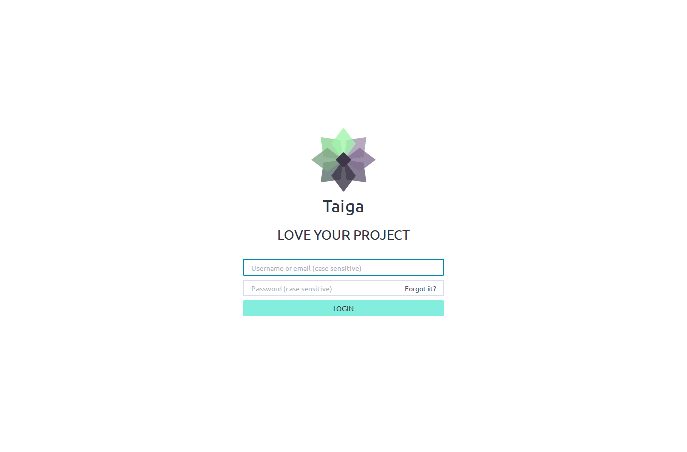 | 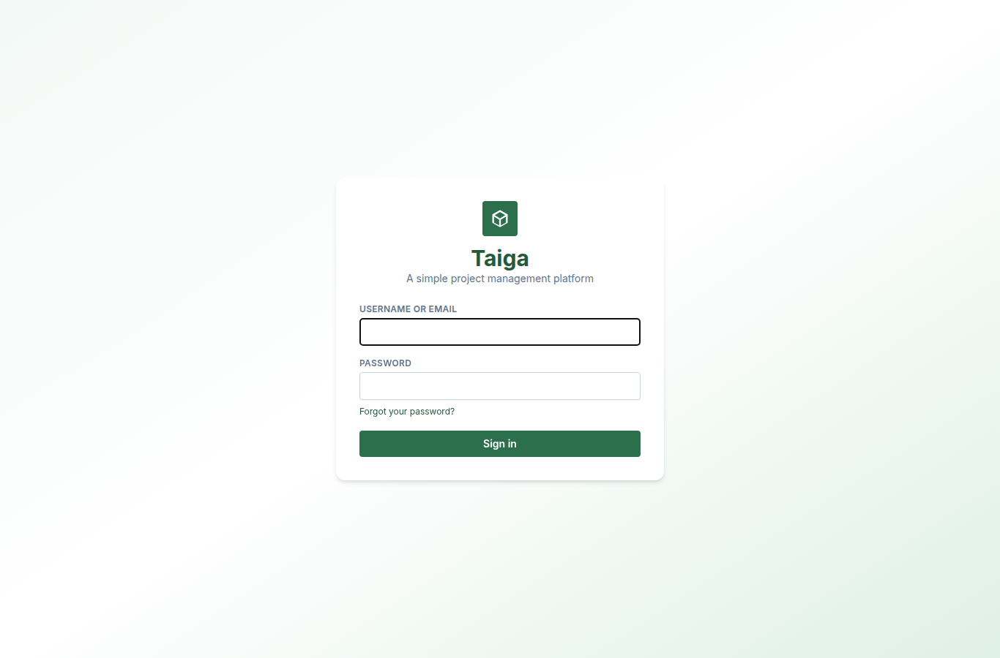 |

### home

| AngularJS (taiga-front, :9000) | React port (web-react, :5173) |
| --- | --- |
| 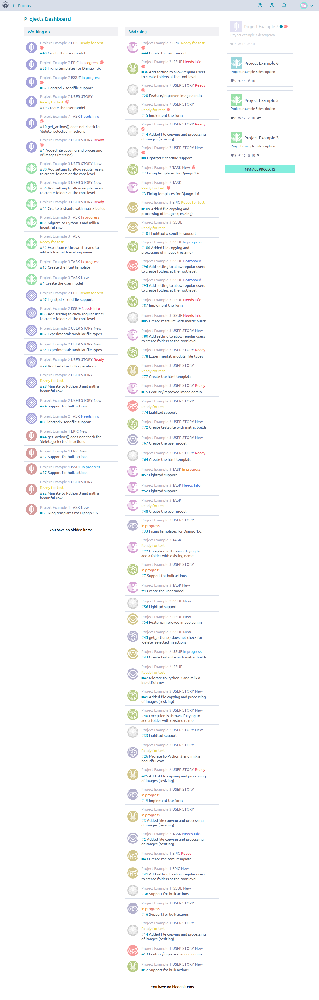 | 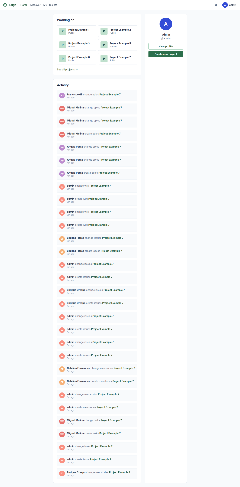 |

### projects

| AngularJS (taiga-front, :9000) | React port (web-react, :5173) |
| --- | --- |
| 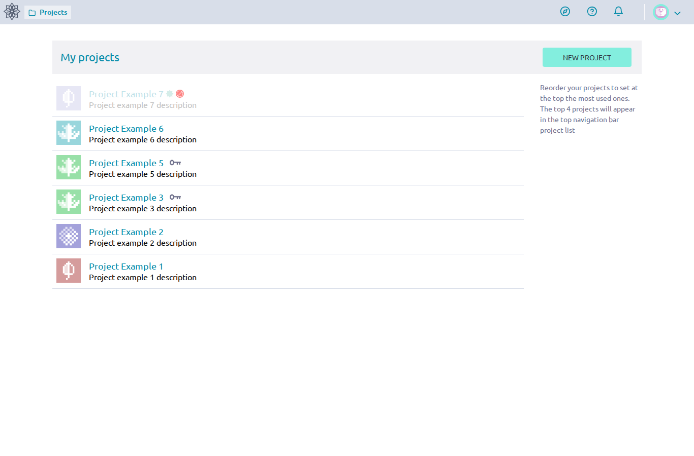 | 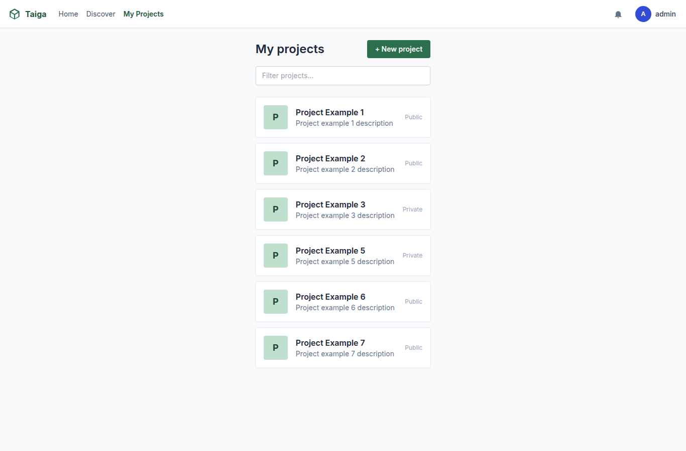 |

### backlog

| AngularJS (taiga-front, :9000) | React port (web-react, :5173) |
| --- | --- |
| 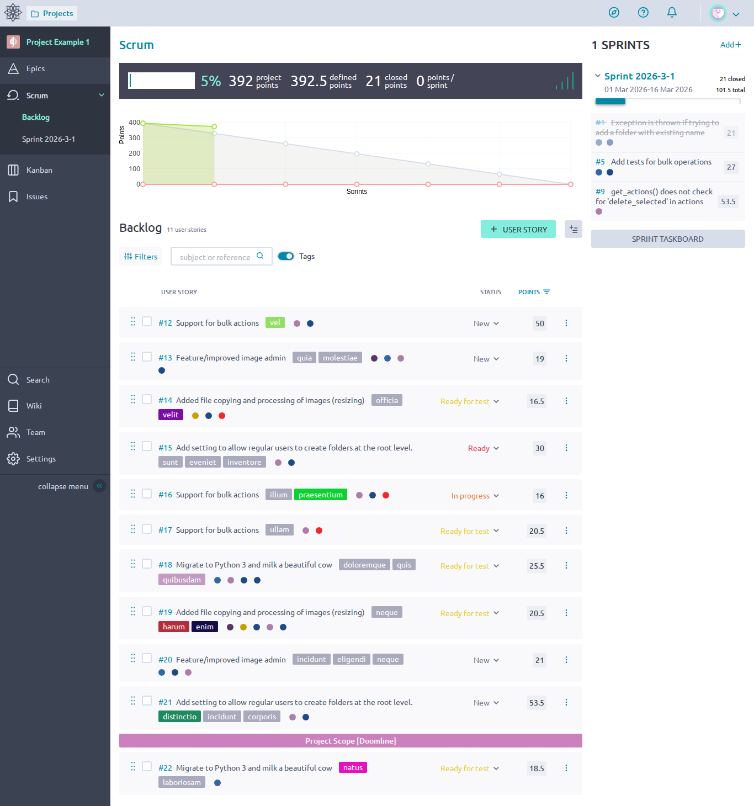 | 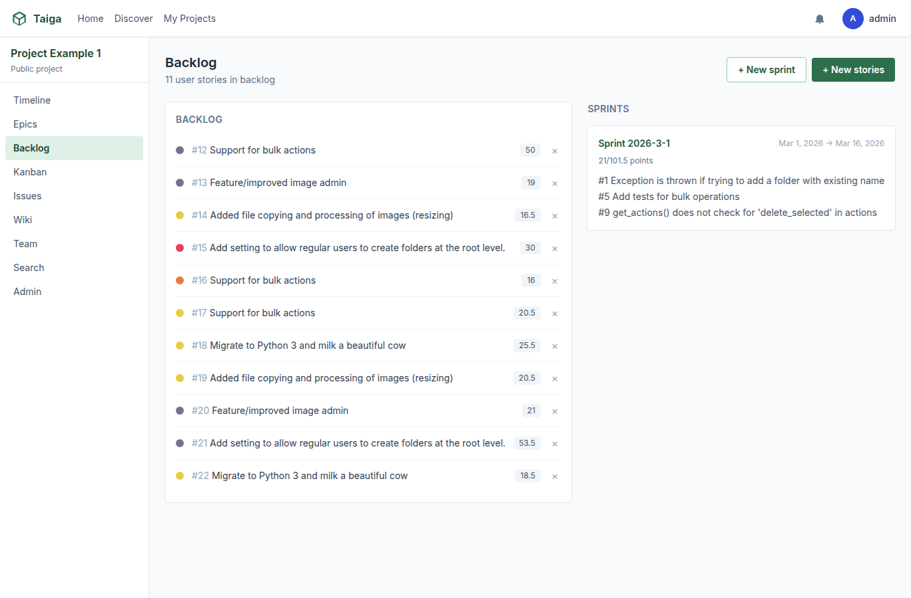 |

### kanban

| AngularJS (taiga-front, :9000) | React port (web-react, :5173) |
| --- | --- |
| 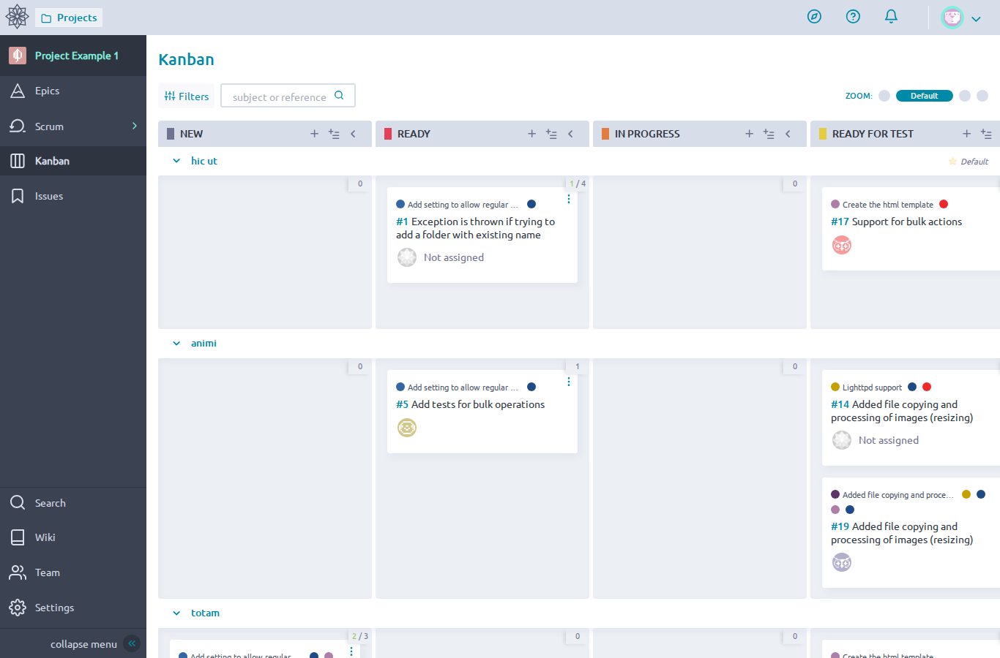 | 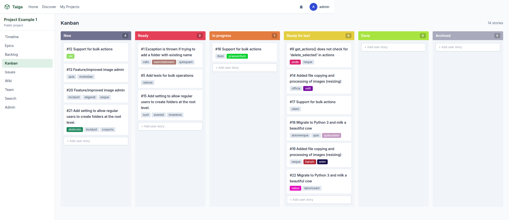 |

### issues

| AngularJS (taiga-front, :9000) | React port (web-react, :5173) |
| --- | --- |
| 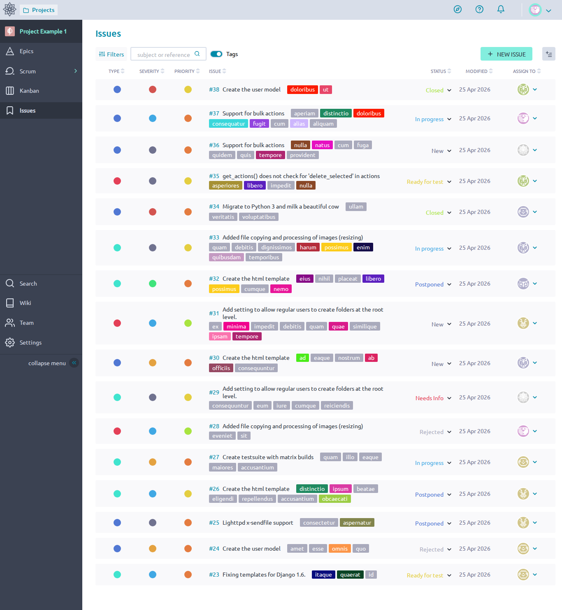 | 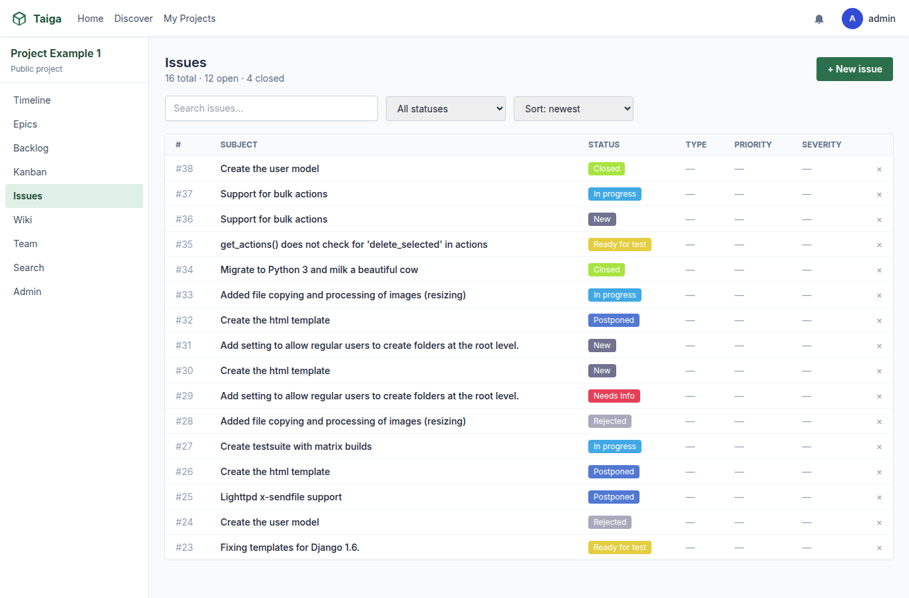 |

## Appendix: full React failure list

- **01-login.spec.ts › Login page › shows the localized tagline "LOVE YOUR PROJECT"**  
  Error: expect(locator).toContainText(expected) failed Locator: locator('body') Timeout: 8000ms Expected pattern: /love your project/i Received string: " TaigaA simple project management platformUsername or emailPasswordForgot your password?Sign in········· " Call log: - Expect "toContainText" with timeout 8000ms - waiting for locator('body') 12 × locator resolved to <body class="bg-slate-50 text-slate-800 antialiased">…</body> - unexpected value " TaigaA simple project management platformUsername or emailPasswordForgot your password?Sign in "

- **01-login.spec.ts › Login page › renders the Taiga star/leaf logo SVG (not a generic placeholder)**  
  Error: expect(received).toBeGreaterThanOrEqual(expected) Expected: >= 5 Received: 0

- **01-login.spec.ts › Login page › uses placeholders "Username or email (case sensitive)" and "Password (case sensitive)"**  
  Error: expect(received).toMatch(expected) Expected pattern: /case sensitive/i Received string: ""

- **01-login.spec.ts › Login page › the submit button is labelled "LOGIN" (uppercase)**  
  Error: expect(locator).toHaveText(expected) failed Locator: locator('form.login-form button[type="submit"], form button[type="submit"]').first() Expected pattern: /login/i Received string: "Sign in" Timeout: 8000ms Call log: - Expect "toHaveText" with timeout 8000ms - waiting for locator('form.login-form button[type="submit"], form button[type="submit"]').first() 12 × locator resolved to <button type="submit" class="btn-primary w-full" data-testid="login-submit">Sign in</button> - unexpected value "Sign in"

- **01-login.spec.ts › Login page › "Forgot it?" link sits inline next to the password field**  
  Error: expect(locator).toBeVisible() failed Locator: locator('a.forgot-pass') Expected: visible Timeout: 8000ms Error: element(s) not found Call log: - Expect "toBeVisible" with timeout 8000ms - waiting for locator('a.forgot-pass')

- **01-login.spec.ts › Login page › the document title is "Login - Taiga"**  
  Error: expect(page).toHaveTitle(expected) failed Expected pattern: /login\s*-\s*taiga/i Received string: "Taiga (React port)" Timeout: 8000ms Call log: - Expect "toHaveTitle" with timeout 8000ms 12 × unexpected value "Taiga (React port)"

- **02-dashboard.spec.ts › Home / Dashboard › page heading reads "Projects Dashboard"**  
  Error: expect(locator).toBeVisible() failed Locator: locator('h1').filter({ hasText: /projects dashboard/i }).first() Expected: visible Timeout: 8000ms Error: element(s) not found Call log: - Expect "toBeVisible" with timeout 8000ms - waiting for locator('h1').filter({ hasText: /projects dashboard/i }).first()

- **02-dashboard.spec.ts › Home / Dashboard › renders both a "Working on" and a "Watching" section**  
  Error: expect(locator).toBeVisible() failed Locator: locator('h1, h2, h3, .title-bar').filter({ hasText: /^\s*watching\s*$/i }).first() Expected: visible Timeout: 8000ms Error: element(s) not found Call log: - Expect "toBeVisible" with timeout 8000ms - waiting for locator('h1, h2, h3, .title-bar').filter({ hasText: /^\s*watching\s*$/i }).first()

- **02-dashboard.spec.ts › Home / Dashboard › Working on rows show project name + ticket type + status + ref**  
  Error: expect(locator).toBeVisible() failed Locator: locator('a.list-itemtype-ticket, .list-itemtype-ticket').first() Expected: visible Timeout: 8000ms Error: element(s) not found Call log: - Expect "toBeVisible" with timeout 8000ms - waiting for locator('a.list-itemtype-ticket, .list-itemtype-ticket').first()

- **02-dashboard.spec.ts › Home / Dashboard › top navbar exposes a Projects dropdown (not a flat tab list)**  
  Error: expect(locator).toBeVisible() failed Locator: locator('nav.navbar') Expected: visible Timeout: 8000ms Error: element(s) not found Call log: - Expect "toBeVisible" with timeout 8000ms - waiting for locator('nav.navbar')

- **02-dashboard.spec.ts › Home / Dashboard › document title is "Home - Taiga"**  
  Error: expect(page).toHaveTitle(expected) failed Expected pattern: /home\s*-\s*taiga/i Received string: "Taiga (React port)" Timeout: 8000ms Call log: - Expect "toHaveTitle" with timeout 8000ms 12 × unexpected value "Taiga (React port)"

- **03-projects-listing.spec.ts › My projects listing › header has a "NEW PROJECT" call-to-action button (uppercase)**  
  Error: expect(locator).toBeVisible() failed Locator: locator('a.create-project-btn.btn-small, a.btn-small.create-project-btn, header a:has-text("New project"), header button:has-text("New project")').first() Expected: visible Timeout: 8000ms Error: element(s) not found Call log: - Expect "toBeVisible" with timeout 8000ms - waiting for locator('a.create-project-btn.btn-small, a.btn-small.create-project-btn, header a:has-text("New project"), header button:has-text("New project")').first()

- **03-projects-listing.spec.ts › My projects listing › shows the "Reorder your projects to set at the top..." help copy**  
  Error: expect(locator).toContainText(expected) failed Locator: locator('body') Timeout: 8000ms Expected pattern: /reorder your projects to set/i Received string: " TaigaHomeDiscoverMy ProjectsAadminMy projects+ New projectPProject Example 1Project example 1 descriptionPublicPProject Example 2Project example 2 descriptionPublicPProject Example 3Project example 3 descriptionPrivatePProject Example 5Project example 5 descriptionPrivatePProject Example 6Project example 6 descriptionPublicPProject Example 7Project example 7 descriptionPublic········· " Call log: - Expect "toContainText" with timeo…

- **03-projects-listing.spec.ts › My projects listing › lists the seeded projects in user-defined order (newest first by default)**  
  Error: expect(received).toBeGreaterThanOrEqual(expected) Expected: >= 6 Received: 0

- **03-projects-listing.spec.ts › My projects listing › does NOT render an in-page "Filter projects" search input**  
  Error: expect(locator).toHaveCount(expected) failed Locator: locator('input[placeholder*="Filter projects" i], input[placeholder*="Search projects" i]') Expected: 0 Received: 1 Timeout: 8000ms Call log: - Expect "toHaveCount" with timeout 8000ms - waiting for locator('input[placeholder*="Filter projects" i], input[placeholder*="Search projects" i]') 12 × locator resolved to 1 element - unexpected value "1"

- **04-sidebar.spec.ts › Project sidebar › shows a "Scrum" group containing Backlog + sprint links (collapsible)**  
  Error: expect(received).toMatch(expected) Expected pattern: /scrum/i Received string: "Project Example 1 Public project Timeline Epics Backlog Kanban Issues Wiki Team Search Admin"

- **04-sidebar.spec.ts › Project sidebar › exposes a "Settings" link (admin gate), not labelled "Admin"**  
  Error: expect(received).toMatch(expected) Expected pattern: /\bsettings\b/i Received string: "Project Example 1 Public project Timeline Epics Backlog Kanban Issues Wiki Team Search Admin"

- **04-sidebar.spec.ts › Project sidebar › exposes a "collapse menu" toggle at the bottom**  
  Error: expect(received).toMatch(expected) Expected pattern: /collapse menu/i Received string: "Project Example 1 Public project Timeline Epics Backlog Kanban Issues Wiki Team Search Admin"

- **04-sidebar.spec.ts › Project sidebar › does NOT include a top-level "Timeline" link**  
  Error: expect(received).toBeFalsy() Received: true

- **04-sidebar.spec.ts › Project sidebar › top-of-sidebar project link uses the project logo image, not initials**  
  Error: expect(received).toBeTruthy() Received: false

- **05-backlog.spec.ts › Backlog page › page section heading reads "Scrum"**  
  Error: expect(locator).toBeVisible() failed Locator: locator('main h1, header h1, h1').filter({ hasText: /^\s*scrum\s*$/i }).first() Expected: visible Timeout: 8000ms Error: element(s) not found Call log: - Expect "toBeVisible" with timeout 8000ms - waiting for locator('main h1, header h1, h1').filter({ hasText: /^\s*scrum\s*$/i }).first()

- **05-backlog.spec.ts › Backlog page › renders the project burndown summary with 5 stat tiles**  
  Error: expect(locator).toBeVisible() failed Locator: locator('.backlog-summary').first() Expected: visible Timeout: 8000ms Error: element(s) not found Call log: - Expect "toBeVisible" with timeout 8000ms - waiting for locator('.backlog-summary').first()

- **05-backlog.spec.ts › Backlog page › renders a burndown chart (canvas)**  
  Error: expect(received).toBeGreaterThan(expected) Expected: > 0 Received: 0

- **05-backlog.spec.ts › Backlog page › toolbar exposes a Filters button + reference search + Tags toggle**  
  Error: expect(locator).toBeVisible() failed Locator: locator('#show-filters-button') Expected: visible Timeout: 8000ms Error: element(s) not found Call log: - Expect "toBeVisible" with timeout 8000ms - waiting for locator('#show-filters-button')

- **05-backlog.spec.ts › Backlog page › each user story row exposes status control + points + 3-dot menu + checkbox**  
  Error: expect(received).toBeGreaterThan(expected) Expected: > 0 Received: 0

- **05-backlog.spec.ts › Backlog page › shows tag chips next to each user story subject**  
  Error: expect(received).toBeGreaterThan(expected) Expected: > 0 Received: 0

- **05-backlog.spec.ts › Backlog page › right-rail sprint card has a "SPRINT TASKBOARD" CTA**  
  Error: expect(locator).toBeVisible() failed Locator: locator('a, button').filter({ hasText: /sprint taskboard/i }).first() Expected: visible Timeout: 8000ms Error: element(s) not found Call log: - Expect "toBeVisible" with timeout 8000ms - waiting for locator('a, button').filter({ hasText: /sprint taskboard/i }).first()

- **06-kanban.spec.ts › Kanban page › column headers are uppercase status names ("NEW", "READY", "IN PROGRESS", "READY FOR TEST")**  
  Error: expect(received).toMatch(expected) Expected pattern: /\bNEW\b/ Received string: "Taiga Home Discover My Projects A admin Project Example 1 Public project Timeline Epics Backlog Kanban Issues Wiki Team Search Admin Kanban 14 stories New 4 #12 Support for bulk actions vel #13 Feature/improved image admin quia molestiae #20 Feature/improved image admin incidunt eligendi neque #21 Add setting to allow regular users to create folders at the root level. distinctio incidunt corporis Ready 3 #1 Exception is thrown if trying to add a folder with existing name odio exercitationem quisquam #5 Add…

- **06-kanban.spec.ts › Kanban page › toolbar has a Filters button + reference search + ZOOM control**  
  Error: expect(locator).toBeVisible() failed Locator: locator('button.btn-filter, #show-filters-button') Expected: visible Timeout: 8000ms Error: element(s) not found Call log: - Expect "toBeVisible" with timeout 8000ms - waiting for locator('button.btn-filter, #show-filters-button')

- **06-kanban.spec.ts › Kanban page › groups stories into swimlanes (one per epic / folder)**  
  Error: expect(received).toBeGreaterThan(expected) Expected: > 2 Received: 0

- **06-kanban.spec.ts › Kanban page › cards display assignee badge ("Not assigned" or avatar)**  
  Error: expect(locator).toContainText(expected) failed Locator: locator('body') Timeout: 8000ms Expected pattern: /not assigned/i Received string: " TaigaHomeDiscoverMy ProjectsAadminProject Example 1Public projectTimelineEpicsBacklogKanbanIssuesWikiTeamSearchAdminKanban14 storiesNew4#12 Support for bulk actionsvel#13 Feature/improved image adminquiamolestiae#20 Feature/improved image adminincidunteligendineque#21 Add setting to allow regular users to create folders at the root level.distinctioinciduntcorporisReady3#1 Exception is thrown if trying to add a folder with existing nameodioexercita…

- **07-issues.spec.ts › Issues page › table columns include TYPE / SEVERITY / PRIORITY / ISSUE / STATUS / MODIFIED / ASSIGN TO**  
  Error: expect(received).toContain(expected) // indexOf Expected substring: "ISSUE" Received string: "Taiga Home Discover My Projects A admin Project Example 1 Public project Timeline Epics Backlog Kanban Issues Wiki Team Search Admin Issues· 16 total · 12 open · 4 closed· + New issue All statuses New In progress Ready for test Closed Needs Info Rejected Postponed Sort: newest Sort: priority Sort: severity # SUBJECT STATUS TYPE PRIORITY SEVERITY· #38 Create the user model Closed — — — × #37 Support for bulk actions In progress — — — × #36 Support for bulk actions New — — — × #35 get_actions() …

- **07-issues.spec.ts › Issues page › column headers have sort arrows / are sortable**  
  Error: expect(received).toBeGreaterThan(expected) Expected: > 0 Received: 0

- **07-issues.spec.ts › Issues page › TYPE / SEVERITY / PRIORITY are rendered as small colored DOTS, not text pills**  
  Error: expect(received).toBeGreaterThan(expected) Expected: > 5 Received: 0

- **07-issues.spec.ts › Issues page › toolbar has Filters + reference search + Tags toggle + "+ NEW ISSUE"**  
  Error: expect(locator).toBeVisible() failed Locator: locator('button.btn-filter').first() Expected: visible Timeout: 8000ms Error: element(s) not found Call log: - Expect "toBeVisible" with timeout 8000ms - waiting for locator('button.btn-filter').first()

- **07-issues.spec.ts › Issues page › each row shows tag chips inline**  
  Error: expect(received).toBeGreaterThan(expected) Expected: > 0 Received: 0

- **07-issues.spec.ts › Issues page › each row exposes an assignee avatar control**  
  Error: expect(received).toBeGreaterThan(expected) Expected: > 0 Received: 0

